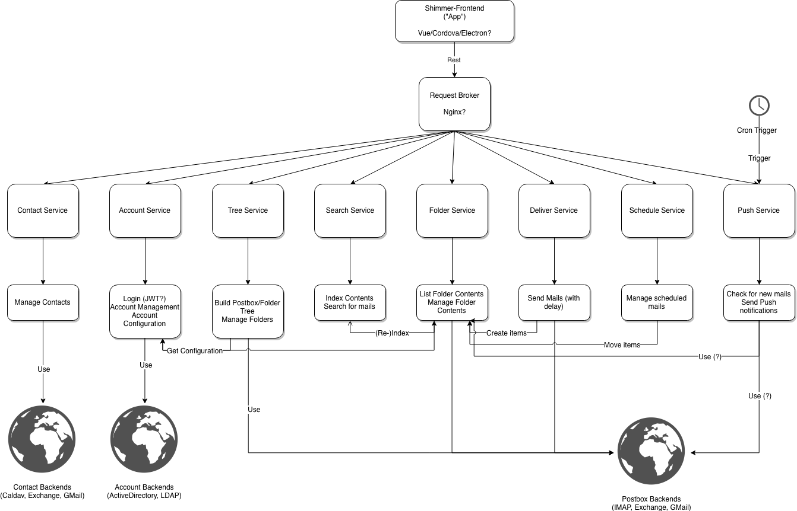

# Shimmer - A modern open source, platform independent mail app (to be)

# Introduction

I've been always a fan of E-Mail since I first knew it and I integrated it perfectly in my daily routine and personal organization. Even in the days of messenger apps and company chat channels, I still clink to mail.

Personally, I envy the [Inbox Zero](https://dev.to/dploeger/get-self-organized-using-inbox-zero-4h3o) methodology and still haven't found the perfect mail client.

There are some clients around like Airmail or Spark, that embrace Inbox Zero, but they all lack in some certain aspects. And as they are proprietary, I can do nothing to change that.

Besides this here. I call it "Shimmer" for the moment.

This is a draft of a fancy modern e-mail application like Airmail or Spark, but with some basic requirements:

* Be platform independent. And by that I mean: *every* platform should be supported. Web, Desktop, Mobile. **Everything**
* Be open source. Certain features of those apps require a backend for periodically checking mail and sending push messages or scheduling mails. I **don't want** my mail accounts to be stored in any server other than one I'm controlling. There *can* be a commercial service hosting a Shimmer server, but you can also download the stuff and get started
* Be modern. Use modern technologies like a rich frontend app, which is connected to a rest backend
* Be secure. Keep an eye out for security, encrypt traffic, test
* Be tested. You know, the real cool developer stuff
* Be kind. Be open to ideas from the outside, gladly accept pull requests

These are basic requirements by my own and I gladly welcome anybody for a chat about these requirements and their implementation.

# Architecture

Talking about implementation, I sketched the following architecture diagram using [draw.io](https://draw.io) as an initial idea of how that idea can be structured.

Take a look:

I'd suggest some design aspects from my experience, but please hit me up for a discussion:

* Use microservices. The microservices approach is greatly adopted and works greatly for this architecture. Don't use a big monolith with everything in it (like other solutions did). Be light and fast
* Use microservices, but come up with a simple deployment option. A big, commercial hosting solution might want to scale the services horizontally, but a small provider might want to "just install" it. So use a docker-compose stack to set everything up. This also helps when developing.
* Use Typescript on all stages. I don't think, that there's still some language over another in the times of microservices and typescript could be one language, that can be used on every stage from frontend to backend. Besides, Javascript has a immense worldwide community
* Use Vue.js (just because I fell in love with it recently)
* Use cordova and electron to package the web app for mobile and desktop. Don't go the lengths of developing separately for web, desktop and mobile.
* Don't support POP3. Really. Don't.
* Support IMAP, Exchange and GMail as these are the most used services currently around, but abstract that access, so another service can be easily adopted